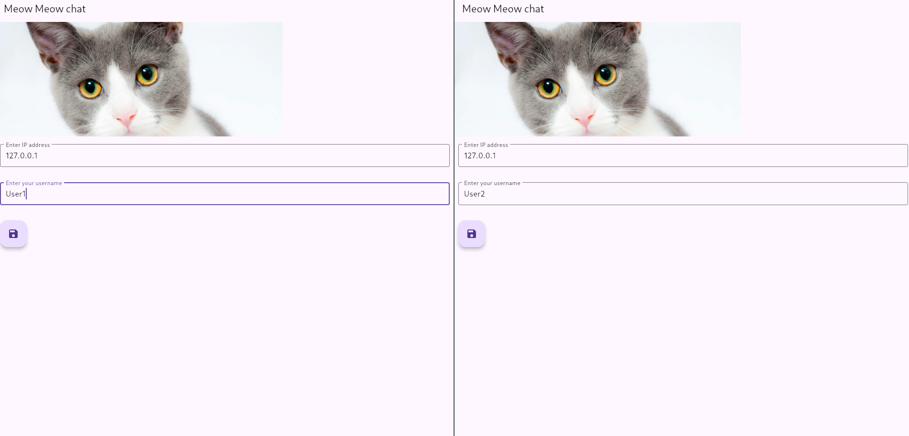
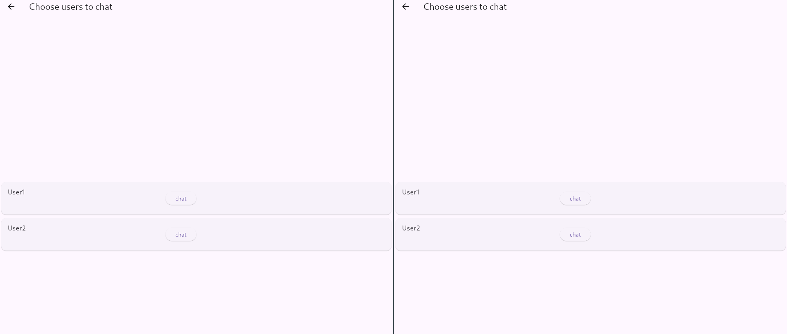
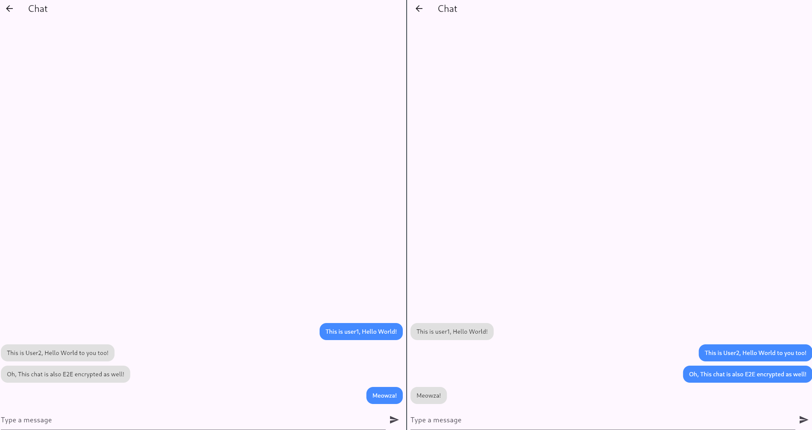

# Meow Meow Chat

This is a chat application written in GoLang, Grpc and Flutter. It features end-to-end encryption to ensure message confidentiality and privacy between users. Messages are encrypted on the sender's device and decrypted only by the intended recipient. This protects them from interception or unauthorized access during transmission. Currently, the backend supports in-memory messaging only. In future iterations, support for persistent storage using various databases and volumes will be added to enhance reliability and scalability.

# The current landing page of the application

# The current chat room page of the application

This allows you to select users that are in the server.

# The current chatting page of the application

